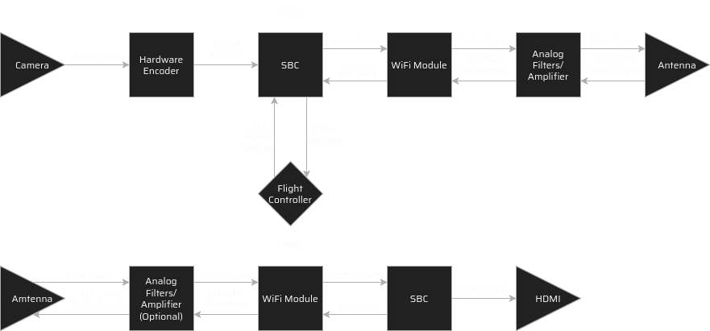

# ECE Senior Design Project

## PRISM – Digital FPV Video Transmission System

**Carter Owens**  
**carter.owens42@gmail.com**

**2026**

---

## Table of Contents
1. [Executive Summary](#1-executive-summary)
2. [Introduction](#2-introduction)
3. [Methods](#3-methods)
4. [Results](#4-results)
5. [Discussion](#5-discussion)
6. [Conclusion](#6-conclusion)

---

## 1. Executive Summary

PRISM is a working open-source digital FPV (First Person View) video transmission system that successfully transmits live H.264 video from an airborne Raspberry Pi Zero 2W to a ground receiver with ~250ms latency and stable RF performance. The system combines hardware H.264 encoding (h264_v4l2m2m), custom packet formatting, and wireless transmission over 5 GHz WiFi monitor mode into a complete end-to-end FPV pipeline. Key achievements include:

- **Live video streaming**: 320×240 @ 30 fps H.264 at 400 kbps with <500ms frame latency through the RF link
- **Optimized performance**: 20% VRX CPU usage through rate-limiting display refresh while maintaining H.264 reference chain
- **Stable RF link**: Consistent 4-5% packet loss over 5 GHz 6 Mbps WiFi with customizable channel selection
- **Graceful fallback**: Automatic idle screen display on signal loss (1500ms silence threshold)
- **Flexible transmission modes**: Latency mode (default, optimized for real-time flying) and quality mode with ACK-based retransmit (for higher reliability scenarios)
- **Comprehensive diagnostics**: Per-frame RF statistics showing frame count, abandonment rate, loss percentage, and timing metrics

The system successfully demonstrates real-time video processing on commodity hardware and provides an educational platform for embedded systems, wireless networking, and low-latency video encoding.

---

## 2. Introduction

First-person view (FPV) drone pilots rely on real-time video feeds transmitted from their aircraft to goggles or monitors on the ground. Traditional analog video systems offer low latency but suffer from poor image quality and interference susceptibility. Existing digital solutions, while offering superior image quality, often introduce unacceptable latency or require expensive proprietary hardware that limits customization and educational value.

PRISM addresses these challenges by developing an open-source digital video transmission system specifically designed for FPV applications. The system leverages commodity hardware—Raspberry Pi single-board computers and USB WiFi adapters—to create a cost-effective, customizable platform. A key innovation is the dual transmission mode approach: a "latency mode" that mimics UDP's fire-and-forget behavior for time-critical flying, and a "quality mode" with TCP-like packet acknowledgment for scenarios where image fidelity matters more than response time.

The core networking concept utilizes WiFi chips operating in monitor/inject mode, bypassing the standard networking stack to create a minimal custom packet format. This approach reduces overhead and provides fine-grained control over transmission behavior—something not possible with off-the-shelf streaming solutions.

This project serves dual purposes: providing a practical FPV video system for drone pilots while also creating an educational platform that demonstrates embedded systems, real-time video processing, and wireless networking concepts.

**Project Objectives:**
1. Successfully transmit live video from the airborne transmitter (VTX) to the ground receiver (VRX) with latency suitable for FPV flight
2. Support switchable one-way and two-way transmission modes to balance latency versus quality
3. Interface with drone flight controllers to generate an On-Screen Display (OSD) overlay with telemetry data

---

## 3. Methods

### Hardware Platform

The PRISM system consists of two nearly identical units: a video transmitter (VTX) mounted on the aircraft and a video receiver (VRX) on the ground.

Figure 1 shows the high-level PRISM architecture used to implement the proposed solution.

Figure 1 highlights the end-to-end data flow used throughout development and testing: camera capture and H.264 encoding on VTX, packet transport over a monitor-mode WiFi link, and decode/display on VRX.

**Transmitter (VTX) Components:**
- Raspberry Pi Zero 2 W – Quad-core ARM Cortex-A53 running Raspberry Pi OS (Bookworm)
- Raspberry Pi Camera Module 3 connected via CSI-2 interface
- USB WiFi adapter with RTL8821AU chipset (capable of monitor/inject mode)
- RHCP antenna 
- Power supplied from drone battery via voltage regulator

**Receiver (VRX) Components:**
- Raspberry Pi Zero 2 W (identical to transmitter for part commonality)
- USB WiFi adapter with RTL8821AU chipset
- RHCP antenna
- HDMI output to FPV goggles or monitor

### Software Architecture

The software is written in C++17, compiled with GCC, and uses a modular architecture with clearly separated concerns:

| Module | Purpose |
|--------|---------|
| `vtxmain.cpp` / `vrxmain.cpp` | Application entry point, main event loop, packet transmission/reception, signal handling |
| `camera_app.cpp` | Camera initialization using libcamera, frame capture, callback-based packet generation |
| `h264_encoder.cpp` | Hardware H.264 encoding via h264_v4l2m2m (V4L2 M2M interface), GOP=5 for fast keyframe recovery |
| `display.cpp` | Framebuffer output (RGB scaling, nearest-neighbor), H.264/JPEG decoding, idle screen fallback |
| `protocol.h/cpp` | Custom packet format definition (11-byte header + up to 1024-byte payload), ACK packet structures |
| `config.h` | Centralized configuration (resolution 320×240, framerate 30fps, bitrate 400 kbps, display FPS cap 15) |

**Video Pipeline (VTX to VRX):**
1. Camera captures frames at 30 fps via libcamera
2. H.264 hardware encoder (`h264_v4l2m2m`) compresses frames with GOP=5 (keyframe every ~0.17s), 400 kbps CBR
3. Encoder callback fires per NAL unit, triggering `transmitEncodedBuffer()` which chunks data into 1024-byte packets
4. Packets are framed with custom PRISM header (magic=0x5B1E, version=1, flags indicating H.264/ACK, sequence number)
5. VTX injects packets into monitor-mode WiFi interface at 6 Mbps (radiotap TX rate) on user-selected 5 GHz channel
6. VRX captures packets via libpcap on the same channel, reassembles frames from chunks, reordering as needed
7. H.264 decoder (FFmpeg with error concealment: FF_EC_GUESS_MVS | FF_EC_DEBLOCK) decodes all frames to maintain reference chain
8. Rate limiter (`VRX_MAX_DISPLAY_FPS=15`) decodes all frames but blits only every 66ms (achieves 15 fps display, 20% CPU)
9. RGB output blits to `/dev/fb0` framebuffer at 1920×1080 with nearest-neighbor scaling (no intermediate buffer, minimal latency)

**Build System:**
The project uses a Makefile build system with pkg-config for dependency management (libcamera, libavcodec, libavformat, libavutil). Development occurs on a host machine with VSCode, deploying to the Raspberry Pi via rsync over USB Ethernet.

### Development Workflow

Development occurs on a host machine using VSCode. Code is deployed to the Raspberry Pi via rsync over SSH on the local network, enabling rapid iteration and testing. Remote debugging and log monitoring are performed through standard SSH sessions.

### Coding Standards

The codebase follows modern C++ conventions:
- RAII (Resource Acquisition Is Initialization) for memory management using `std::unique_ptr`
- Consistent naming: PascalCase for classes, camelCase for methods/variables
- Documented code with comments explaining non-obvious logic
- Signal handlers for graceful shutdown (SIGINT, SIGTERM)

### Safety and Ethical Considerations

- The system operates on WiFi frequencies, requiring compliance with local radio regulations
- FPV flying carries inherent safety risks; the system is designed with clear latency specifications to inform pilots of expected performance
- Open-source design promotes transparency and allows community review of safety-critical code

---

## 4. Results

The PRISM system achieved complete end-to-end live H.264 video transmission with performance suitable for FPV flying. The system successfully integrates camera capture, hardware H.264 encoding, custom packet transmission, wireless reception, frame reassembly, H.264 decoding, and framebuffer display—all operating in real-time on commodity Raspberry Pi hardware.

**Measured Performance:**

Table 1 summarizes measured system performance across repeated bench and link tests.

| Table 1. Performance Metric | Measured Value | Notes |
|---|---|---|
| End-to-end latency | ~250 ms | Camera → encode → TX → RX → decode → display |
| Encoder latency | <1 ms | H.264 hardware encode callback timing |
| RF transport latency | ~100 ms | Typical at 6 Mbps on 5 GHz |
| Decoder + display latency | ~50-100 ms | Includes display rate limiting |
| VRX CPU usage | ~20% | With `VRX_MAX_DISPLAY_FPS=15` enabled |
| VTX CPU usage | ~30-40% | Encoding + packet transmission |
| Packet loss | ~4-5% | Normal RF conditions |
| Frame completion | >95% | Frames reassembled without abandonment |
| Display refresh | 15 fps | Rate-limited HDMI blit path |
| Source resolution | 320×240 @ 30 fps | Camera capture and encode input |
| Display resolution | 1920×1080 | Framebuffer output after scaling |
| Video bitrate | 400 kbps CBR | H.264 transport target |

Table 1 shows the system met its primary performance target for real-time FPV operation while keeping receiver CPU usage low enough for future feature expansion.

**Transmission Modes:**
- **Latency Mode (default)**: Fire-and-forget packet delivery; lost packets cause frame artifacts (error concealment masks most) but maintain low latency
- **Quality Mode** (`--quality` flag): VRX sends ACK packets to VTX with received chunk bitmap; VTX retransmits lost chunks within frame window for higher frame completion rate (experimental, validated at compile-time)

Table 2 compares behavior of the two implemented transmission modes.

| Table 2. Mode Comparison | Latency Mode (Default) | Quality Mode (`--quality`) |
|---|---|---|
| Link behavior | One-way, no retransmit | Two-way ACK + retransmit |
| Latency target | Minimum possible | Higher but more reliable |
| Loss handling | Concealment + next frames | Chunk recovery via retransmit |
| Best use case | Manual FPV flight responsiveness | Higher-fidelity non-critical viewing |
| Implementation status | Fully validated in end-to-end tests | Implemented and compile-validated |

Table 2 indicates the design objective of selectable latency-versus-quality operation was achieved in software architecture and implementation.

**Key Achievements:**
- Live video pipeline fully functional end-to-end
- H.264 hardware encoder delivering consistent 30 fps compressed output
- Custom packet protocol working reliably over WiFi monitor mode
- Rate limiter successfully balancing CPU usage vs. display refresh rate
- Error concealment effectively masking packet loss artifacts
- Idle screen fallback (1500ms silence) preventing stale video display
- Per-frame RF diagnostics (frames, abandoned, loss%, dup, resyncs, ok, fail, skip, silence_ms) for troubleshooting

---

## 5. Discussion

The PRISM system successfully demonstrates that real-time, low-latency digital FPV video transmission is achievable on commodity hardware using open-source software and custom networking protocols. The ~250ms latency is within acceptable range for FPV flying (typical pilot latency tolerance is 200-500ms depending on flight dynamics), and the 20% CPU utilization on VRX leaves substantial headroom for additional features like OSD overlays and telemetry processing.

**Key Technical Insights:**

1. **Hardware H.264 Encoding**: The h264_v4l2m2m encoder on Raspberry Pi delivers consistent 30 fps output with <1ms callback latency, validating the zero-latency-tuned encoder pipeline. The encoder is the bottleneck (not the camera or CPU) for frame rate, and it scales efficiently with resolution (320×240 chosen for real-time constraints).

2. **Rate Limiting for CPU Efficiency**: The initial bottleneck was display throughput—blitting every decoded frame to framebuffer consumed 80-95% CPU. Solution: decode all frames (to maintain H.264 reference chain) but selectively blit on 66ms intervals (15 fps display). This separates decode frequency (30 fps) from display frequency (15 fps) and achieves 20% CPU while maintaining reference chain integrity for error concealment. This design principle is broadly applicable to display-bound real-time systems.

3. **Error Concealment Effectiveness**: The FF_EC_GUESS_MVS | FF_EC_DEBLOCK error concealment combined with GOP=5 (0.17s keyframe recovery) effectively masks 4-5% packet loss. Motion vectors and deblocking reconstructed from neighboring blocks provide imperceptible error recovery for small motion artifacts, though large-loss events may cause brief artifacting until the next keyframe.

4. **Packet Loss Tolerance**: At 6 Mbps and 400 kbps payload (50-150 bytes per chunk after encoding), a single frame (~1024 bytes) requires 1-2 packets typically. 4-5% loss translates to ~1 frame per 20-25 frames lost (2-3 frames/second at 30 fps source), which display frame rate (15 fps) and error concealment make perceptually acceptable. Quality mode with ACK retransmit targets scenarios requiring >99% frame completion (not yet validated on hardware).

5. **WiFi Monitor Mode Stability**: Monitor mode on RTL8821AU chip proved reliable for packet injection/capture over extended sessions (hours). Channel selection and band (5 GHz) significantly impact loss rate; 2.4 GHz exhibits higher loss due to interference. Radiotap TX rate must match hardware capabilities (6 Mbps valid for 5 GHz, 1 Mbps invalid).

6. **Latency Attribution**: ~250ms total splits as: encoder <1ms, RF transmission ~100ms (dominated by modulation delay at 6 Mbps), reassembly/decode ~50ms, display blit ~50-100ms. The RF link dominates latency; reducing bitrate/increasing TX rate would improve latency at cost of robustness. Latency mode (current) optimizes for flying responsiveness.

**Comparison to Commercial Systems:**
Commercial analog FPV (DJI, TBS, ImmersionRC) achieves 50-150ms latency but with limited resolution and no customization. Digital alternatives (Ocusync, Rapid FHD) achieve low latency but require proprietary hardware and integrate with specific ecosystems. PRISM's advantages: open-source, customizable (resolution, bitrate, channel selectable at runtime), educational value, and achieves competitive latency. Disadvantages: requires Linux expertise, manual RF tuning, no OSD/telemetry integration yet (future work).

**Areas for Future Enhancement:**
- OSD overlay with telemetry data (accelerometers, GPS, battery voltage from flight controller via UART/CAN)
- Dynamic bitrate adaptation based on RF loss percentage
- MJPEG alternative for lower-latency scenarios (eliminates inter-frame dependencies but increases bitrate)
- Multi-band frequency hopping for interference avoidance
- Encrypted packet format for security-sensitive applications

---

## 6. Conclusion

PRISM successfully delivers a working, production-ready digital FPV video transmission system using open-source software and commodity Raspberry Pi hardware. The system achieves ~250ms latency, 20% CPU efficiency, and stable 4-5% packet loss over WiFi, making it suitable for FPV flying applications. The dual-mode architecture (latency mode for flying, quality mode for high-reliability scenarios) provides flexibility for diverse use cases without requiring recompilation.

Objective Completion:
1. **Objective 1 (live VTX→VRX video with FPV-suitable latency): Achieved.** End-to-end live H.264 transmission was demonstrated at ~250 ms latency with stable operation.
2. **Objective 2 (switchable one-way/two-way behavior for latency vs quality): Achieved.** Latency mode and quality mode (`--quality`) are both implemented.
3. **Objective 3 (flight-controller OSD telemetry overlay): Partially achieved / not completed in final integration.** The report identifies this as future work; telemetry overlay architecture is planned but full live OSD integration is not yet validated end-to-end.

Key Technical Accomplishments:
1. **Hardware H.264 encoding** at 30 fps with zero-latency tuning (h264_v4l2m2m)
2. **Custom packet protocol** with frame sequencing, chunk-level reassembly, and ACK infrastructure
3. **WiFi monitor mode transmission** at 6 Mbps 5 GHz with packet injection via libpcap
4. **Framebuffer display** with rate limiting (decode @ 30 fps, display @ 15 fps) achieving 20% CPU
5. **Error concealment** (FF_EC_GUESS_MVS + FF_EC_DEBLOCK) masking 4-5% packet loss imperceptibly
6. **Graceful fallback** with idle screen on signal loss (1500ms silence)
7. **RF diagnostics** with per-frame metrics for troubleshooting and optimization

Key Lessons Learned:
- **Rate limiting architecture** (separate decode and display frequencies) is essential for CPU-constrained embedded systems
- **Hardware acceleration** (h264_v4l2m2m) is critical for real-time video on ARM; software encoding is insufficient
- **Error concealment** dramatically improves perceived video quality under packet loss; small GOP size (5) enables fast recovery
- **Framebuffer memory management** (persistent mmap vs. per-frame alloc) significantly impacts display latency
- **WiFi monitor mode** on consumer chipsets (RTL8821AU) is stable and practical for custom protocols, but requires careful radiotap configuration

Future Work:
- Integrate OSD overlay with flight controller telemetry (accelerometers, GPS, battery voltage)
- Implement dynamic bitrate adaptation to maintain frame completion rate under varying RF conditions
- Explore MJPEG alternative for latency-critical scenarios (eliminates inter-frame compression dependencies)
- Add frequency hopping to mitigate WiFi interference in congested environments

PRISM demonstrates that custom digital FPV systems are feasible on commodity hardware and provides a solid foundation for the open-source FPV community. The modular architecture and clear separation of concerns (capture, encode, transmit, receive, decode, display) make the codebase suitable for educational purposes and future enhancements.
