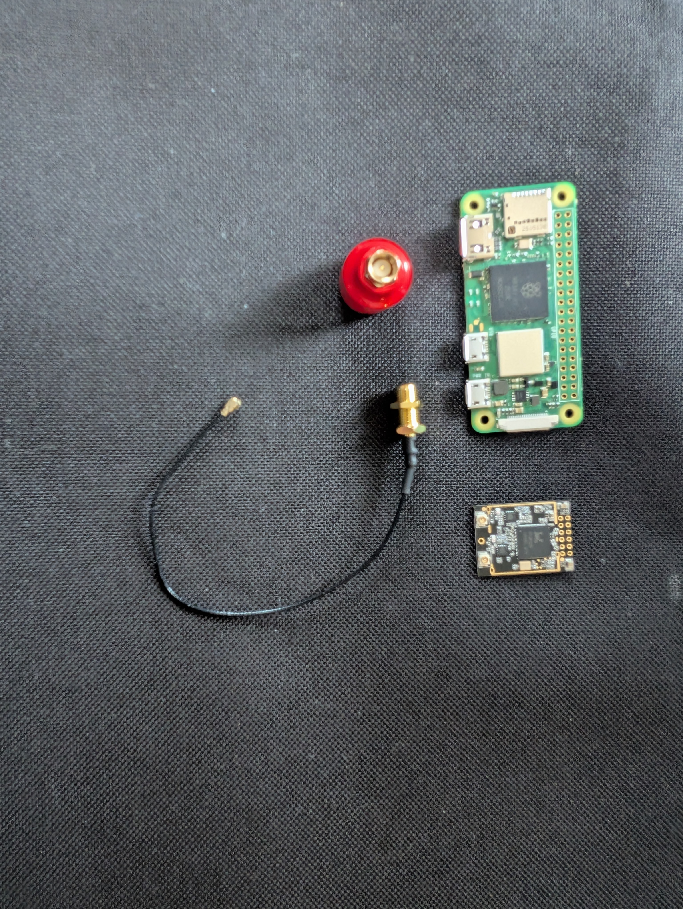

# PRISM FPV Video Transmission System – User Guide

---

## Introduction

### What will these instructions help me do?

This user guide provides complete setup and operation instructions for the PRISM digital FPV video transmission system. By following this guide, you will be able to:

- Assemble the transmitter and receiver units
- Configure the software on both Raspberry Pi units
- Establish a wireless video connection between transmitter and receiver
- Stream live video from an onboard camera to a ground receiver with minimal latency
- Switch between low-latency and high-quality transmission modes
- Troubleshoot common connection and performance issues

### Is there anything special I need to know?

- **Raspberry Pi experience recommended**: Familiarity with Linux command line and SSH connections is helpful
- **Network configuration required**: You will need to configure WiFi settings and network parameters
- **Patience during first setup**: The initial configuration may take 30-45 minutes
- **Power management important**: Ensure both units have adequate power throughout operation
- **Antenna placement critical**: Proper antenna alignment significantly affects video quality and range

---

## Description of Equipment

### Transmitter Unit (VTX)

The transmitter unit captures video from a camera and broadcasts it over WiFi.

**Main Components:**

- **Raspberry Pi Zero 2 W** – Compact single-board computer that processes video
- **Raspberry Pi Camera Module 3** – CSI-2 camera interface for video capture
- **USB WiFi Adapter** (RTL8821AU chipset) – Wireless transmission interface
- **RHCP Antenna** – Right-hand circularly polarized antenna for transmission
- **Mounting bracket** – Hardware for drone integration

### Receiver Unit (VRX)

The receiver unit captures transmitted video and displays it on a monitor or FPV goggles.

**Main Components:**

- **Raspberry Pi Zero 2 W** – Single-board computer for video decoding
- **USB WiFi Adapter** (RTL8821AU chipset) – Wireless reception interface
- **RHCP Antenna** – Right-hand circularly polarized antenna for reception
- **HDMI output cable** – Connection to monitor or FPV goggles
- **Cooling case** (optional) – Passive heatsink case for temperature management

### Software Tools

The PRISM system uses the following software components:

- *libcamera* – Modern camera interface for Raspberry Pi
- *FFmpeg* – Video encoding and decoding
- *WiFi Monitor Mode* – Wireless packet injection for minimal packet overhead
- *Custom C++ application* – Core PRISM transmitter and receiver software

---

## List of Materials/Tools Needed

### Hardware Components

| Component | Quantity | Notes |
|-----------|----------|-------|
| Raspberry Pi Zero 2 W | 2 | One for transmitter, one for receiver |
| Raspberry Pi Camera Module 3 | 1 | For transmitter unit only |
| USB WiFi Adapter (RTL8821AU) | 2 | One per Raspberry Pi |
| RHCP Antenna | 2 | antenna |
| Micro-HDMI to HDMI Cable | 1 | For receiver video output |
| MicroSD Card (32GB+) | 2 | For operating system storage |

### Software and Tools

- **Raspberry Pi OS lite (Bookworm)** – Official operating system
- **SSH client** – For remote access (*PuTTY*, *OpenSSH*, or terminal equivalent)
- **MicroSD card flashing tool** – *Raspberry Pi Imager* or *Etcher*
- **Text editor** – For configuration file editing
- **Network configuration utility** – WiFi connection management

---

## Safety Warnings

**ELECTRICAL SAFETY**
- Never connect power while performing hardware assembly
- Always use approved power adapters rated for 5V, 2.5A minimum
- Do not modify power cables or connectors
- Keep liquids away from all electronic components
- Disconnect power before handling internal components

**HARDWARE SAFETY**
- Handle Raspberry Pi boards by the edges only
- Avoid static electricity – use an anti-static wrist strap when handling components
- Do not force connectors; align carefully before inserting
- Allow adequate ventilation for cooling, especially during extended operation
- Do not obstruct fan vents if using cooled cases

**OPERATING SAFETY**
- Do not operate transmitter near hospitals, aircraft, or restricted areas
- Check local regulations regarding unlicensed wireless operation on 2.4 GHz band
- Maintain visual line of sight with any associated drone

---

## Directions

### Phase 1: Hardware Assembly

#### Step 1: Prepare the Transmitter Unit

1. Gather transmitter components (Raspberry Pi Zero 2 W, Camera Module 3, WiFi adapter, RHCP antenna)
2. Verify all components are present and undamaged

**Information:** Inspect the camera module ribbon cable for any tears or creases. The ribbon cable is fragile and easily damaged.

3. Gently insert the camera ribbon cable into the CSI-2 port on the Raspberry Pi
   - Open the ribbon cable connector by lifting the small plastic tab
   - Slide the ribbon cable in fully – the contact side faces downward
   - Press the tab down firmly to secure the cable

**Information:** The camera connector can be stiff on new boards. Do not force it; ensure the ribbon aligns straight.

4. Attach the USB WiFi adapter to the Raspberry Pi using a USB micro-B adapter cable
5. Attach the RHCP antenna to the WiFi adapter's antenna connector

#### Step 2: Prepare the Receiver Unit

1. Gather receiver components (Raspberry Pi Zero 2 W, WiFi adapter, LHCP antenna, HDMI cable, power cable)
2. Attach the USB WiFi adapter to the Raspberry Pi
3. Attach the RHCP antenna to the WiFi adapter
4. Connect the Micro-HDMI to HDMI cable to the HDMI port on the Raspberry Pi

**Information:** The Raspberry Pi Zero uses a Micro-HDMI connector, not full-size HDMI.

5. Set the receiver unit aside in a safe location

### Phase 2: Software Installation

#### Step 3: Flash Operating System

1. Insert a microSD card into your computer
2. Open *Raspberry Pi Imager*
3. Click **Choose OS** and select *Raspberry Pi OS (Bookworm, 64-bit)*
4. Click **Choose Storage** and select your microSD card
5. Click **Edit Settings** to configure:
   - Hostname: `prism-vtx` (transmitter) or `prism-vrx` (receiver)
   - Username: `pi`
   - Password: (set a secure password)
   - WiFi SSID: (optional, can configure later)

**Information:** Save your hostname and login credentials. You will need them for remote access.

6. Click **Write** and wait for the operation to complete
7. Eject the microSD card safely
8. Repeat for the second Raspberry Pi with appropriate hostname

#### Step 4: Boot and Initial Network Configuration

1. Insert the flashed microSD card into the Raspberry Pi
2. Connect the USB power adapter to the Raspberry Pi
3. Wait 60 seconds for the first boot to complete
4. Connect to the Raspberry Pi using SSH:

       ssh pi@prism-vtx.local

**Information:** The `.local` hostname works if Bonjour/mDNS is available on your network. If that doesn't work, find the IP address using your router's interface or a network scanning tool.

5. Enter the password you configured in Step 3
6. Update the system packages:

       sudo apt update && sudo apt upgrade -y

**Information:** This step may take 10-15 minutes. Allow it to complete without interruption.

#### Step 5: Install PRISM Software

1. Clone the PRISM repository:

       cd ~
       git clone https://github.com/PrismOrg/PRISM.git

2. Navigate to the project directory:

       cd PRISM

3. Run the setup script:

       bash setup-prism-usb.sh

**Information:** This script installs all required dependencies including libcamera, FFmpeg, and development libraries.

4. Compile the PRISM application:

       cd Code
       make clean
       make

**Information:** Compilation may take 5-10 minutes on the Raspberry Pi Zero. Do not power off during this time.

5. Repeat Steps 4 and 5 for the receiver unit (`prism-vrx`)

### Phase 3: System Configuration and Testing

#### Step 6: Configure WiFi Monitor Mode

1. SSH into the transmitter unit:

       ssh pi@prism-vtx.local

2. Bring down the WiFi interface:

       sudo ip link set wlan0 down

3. Set the interface to monitor mode:

       sudo iw dev wlan0 set type monitor

4. Bring the interface back up:

       sudo ip link set wlan0 up

5. Verify monitor mode is active:

       iw dev wlan0 link

**Expected output:** Should show `Not connected` and monitor mode enabled.

**Information:** Monitor mode allows direct packet injection, which is essential for PRISM's minimal overhead transmission.

6. Repeat for the receiver unit on interface `wlan0`

#### Step 7: Launch Transmitter

1. SSH into the transmitter unit
2. Start the transmitter application:

       cd ~/PRISM/Code
       ./prism_vtx --mode latency --ssid PRISM --channel 6

**Information:** 
- `--mode latency` enables low-latency mode (no packet confirmation)
- `--mode quality` enables high-quality mode (with packet confirmation)
- `--channel 6` selects WiFi channel 6. Adjust based on interference analysis.
- `--ssid PRISM` sets the broadcast identifier

3. Verify the application started successfully – you should see:

       [VTX] Camera initialized
       [VTX] WiFi interface ready
       [VTX] Encoding active

**Information:** The transmitter will begin capturing video and encoding it immediately.

#### Step 8: Launch Receiver

1. SSH into the receiver unit
2. Connect the HDMI output to your monitor or FPV goggles
3. Start the receiver application:

       cd ~/PRISM/Code
       ./prism_vrx --mode latency --ssid PRISM --channel 6

**Information:** The receiver mode and channel must match the transmitter settings.

4. Verify the application started:

       [VRX] WiFi interface ready
       [VRX] Waiting for video stream...

5. Monitor the receiver terminal for connection status:

       [VRX] Video stream detected
       [VRX] Decoding active
       [VRX] HDMI output ready

**Information:** You should see video on your monitor within 2-5 seconds of transmitter launch.

### Phase 4: Switching Transmission Modes

#### Step 9: Switch Between Modes

**To switch to high-quality mode with packet confirmation:**

1. Stop the current application on both units:

       CTRL+C

2. On the transmitter, restart with quality mode:

       ./prism_vtx --mode quality --ssid PRISM --channel 6

3. On the receiver, restart with quality mode:

       ./prism_vrx --mode quality --ssid PRISM --channel 6

**Information:** Quality mode adds TCP-like packet confirmation, resulting in higher latency (~200-300ms) but more reliable video.

**To switch back to latency mode:**

1. Repeat the same process with `--mode latency`
2. You should observe lower latency (~50-100ms) with occasional frame drops under poor signal conditions

**Information:** Monitor signal strength and adjust antenna positioning to optimize for your environment.

---

## Troubleshooting

### Issue: Cannot SSH into Raspberry Pi

**Symptom:** Connection timeout or "host unreachable" error

**Solutions:**
1. Verify the Raspberry Pi is powered on (LED indicator should be lit)
2. Check that you're on the same network:
   - On your computer, open a terminal and run: `ping prism-vtx.local`
   - If no response, find the IP address using your router's connected devices list
   - SSH directly using IP: `ssh pi@192.168.1.xxx`
3. Verify SSH is enabled (it is by default in Raspberry Pi OS Bookworm)
4. Try using the IP address instead of hostname:
   - `ssh pi@<IP_ADDRESS>`
5. Restart the Raspberry Pi:
   - Disconnect power, wait 10 seconds, reconnect

### Issue: Camera Module Not Detected

**Symptom:** Error message "Camera initialization failed" or "No camera detected"

**Solutions:**
1. Power off the Raspberry Pi: `sudo poweroff`
2. Verify the camera ribbon cable is fully inserted and aligned
3. Check that the CSI-2 connector tab is closed securely
4. Power on and test with:

       libcamera-hello --list-cameras

5. If still not detected, try re-seating the ribbon cable:
   - Power off and unplug
   - Lift the connector tab on the Raspberry Pi CSI-2 port
   - Gently remove and re-insert the ribbon cable
   - Close the tab firmly

### Issue: WiFi Adapter Not Appearing

**Symptom:** `iw dev` returns no devices or errors about unknown command

**Solutions:**
1. Verify the WiFi adapter is physically connected to the USB port
2. Check if it's recognized by the system:

       lsusb | grep -i rtl

3. Verify the RTL8821AU driver is installed:

       modprobe rtl8xxx

4. If driver is missing, reinstall it:

       cd ~/PRISM
       bash setup-prism-usb.sh

5. Reboot the Raspberry Pi after driver installation:

       sudo reboot

### Issue: Monitor Mode Fails to Activate

**Symptom:** Error message when running `iw dev wlan0 set type monitor`

**Solutions:**
1. Verify the interface name is correct:

       ip link show

2. Ensure the WiFi interface is down before changing mode:

       sudo ip link set wlan0 down

3. Check for conflicting services (NetworkManager, dhcpcd):

       sudo systemctl stop NetworkManager
       sudo systemctl disable NetworkManager

4. Try disabling the interface completely before switching:

       sudo nmcli radio wifi off

5. Verify that your WiFi adapter supports monitor mode:

       iw phy

### Issue: No Video Signal on Receiver

**Symptom:** Receiver terminal shows "Waiting for video stream..." but no video appears

**Solutions:**
1. Verify both units are using the same configuration:
   - Same SSID
   - Same WiFi channel
   - Same transmission mode (latency or quality)
2. Check signal strength on the receiver:

       iw wlan0 station dump | grep signal

3. Increase antenna distance by 1-2 feet and retest (too close can cause saturation)
4. Verify HDMI connection:
   - Unplug and reconnect the Micro-HDMI cable firmly
   - Test with a different HDMI cable if available
5. Check receiver logs for errors:

       ./prism_vrx --mode latency --ssid PRISM --channel 6 --verbose

6. Restart both applications:
   - Stop both with `CTRL+C`
   - Wait 5 seconds
   - Restart transmitter first, wait 3 seconds, then receiver

### Issue: Video Freezes or Stutters

**Symptom:** Video playback is choppy or freezes intermittently

**Solutions:**
1. Check transmitter CPU and memory usage:

       top

2. If CPU is >90%, reduce encoding bitrate or resolution
3. Switch to latency mode if using quality mode (fewer packets to process)
4. Move antennas farther apart (ensure clear line of sight)
5. Change WiFi channel to avoid interference:
   - Try channels 1, 6, or 11 for 2.4GHz
   - Use a WiFi analyzer app to find less congested channels
6. Reduce transmission power if experiencing saturation:

       iw reg set US
       iw phys

### Issue: High Latency in Latency Mode

**Symptom:** Still experiencing 200+ ms latency when using `--mode latency`

**Solutions:**
1. Verify latency mode is active on both units
2. Reduce video resolution in configuration:
   - Edit the transmitter config file
   - Lower framerate from 30fps to 15fps if necessary
3. Check for background processes consuming network bandwidth:

       iftop -i wlan0

4. Ensure antennas are properly aligned and positioned
5. Move away from sources of RF interference (microwaves, cordless phones, other WiFi networks)

### Issue: Cannot Connect to HDMI Output

**Symptom:** "No signal" message on monitor or blank screen

**Solutions:**
1. Verify Micro-HDMI cable is fully inserted
2. Test with a different HDMI cable (some cables don't support Pi's resolution)
3. Try a different HDMI input on your monitor
4. Restart the receiver application
5. Check if HDMI output is enabled:

       tvservice -s

6. If disabled, enable it:

       tvservice -p

---

## Conclusion

### What should I have when you're done?

Upon successful completion of this setup guide, you should have:

**Two fully assembled Raspberry Pi units:**
- Transmitter with camera module and antenna
- Receiver with HDMI output and antenna

**Functional software installation:**
- Both units running PRISM software
- Monitor mode enabled on WiFi adapters
- All dependencies properly installed

**Active video transmission:**
- Live video stream from camera to receiver
- Selectable transmission modes (latency or quality)
- Stable WiFi connection between units

**Understanding of operations:**
- How to launch and stop the transmitter and receiver
- How to switch between transmission modes
- How to monitor system performance
- How to troubleshoot common issues

**Documentation for future reference:**
- This user guide saved for troubleshooting
- Network configuration documented
- WiFi channel and SSID settings recorded

### Next Steps

- **Optimize your setup:** Adjust antenna positioning and WiFi channels based on your local RF environment
- **Extend range:** Experiment with high-gain antennas and directional antenna arrays
- **Customize settings:** Modify encoding parameters for your specific use case
- **Expand functionality:** Integrate with drone autopilot systems or add additional features
- **Join the community:** Share your experiences and contribute improvements to the PRISM project
