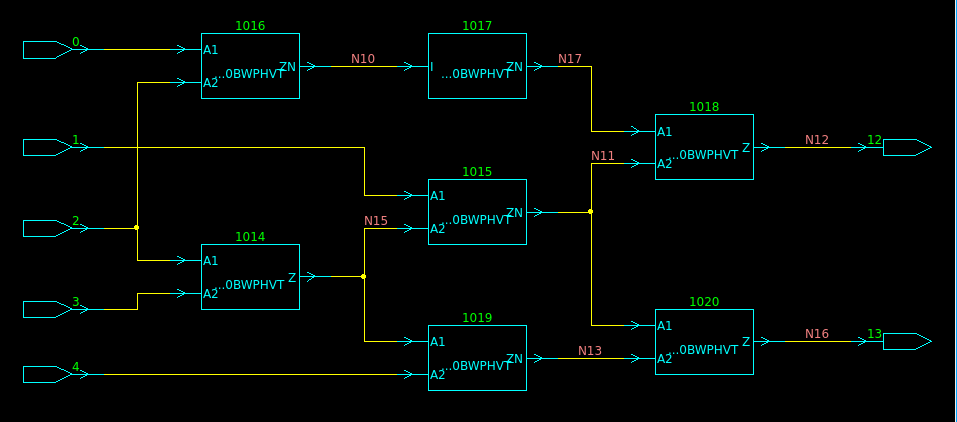
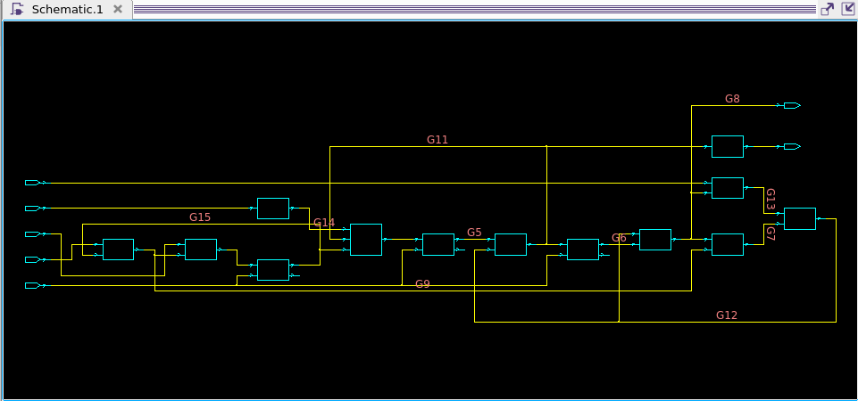

# Problem 1

## 1

## 2

| PI | 1 | 2 | 3 | 4 | 5 | O1 | O2 |
|----|---|---|---|---|---|----|----|
| V1 | 1 | 0 | 0 | 0 | 0 | 0  | 1  |
| V2 | X | 0 | 0 | 0 | 0 | 0  | 1  |
| V3 | 0 | 1 | 0 | X | X | 0  | X  |
| V4 | 1 | 0 | X | 0 | 1 | X  | 1  |

# Problem 2

## (A) 

| Fault | List all Equivallent Faults |
|-------|-----------------------------|
|  1/0  | $\emptyset$                 |
|  1/1  | 5/1 7/1 13/0 16/0 18/0      |
|  2/0  | $\emptyset$                 |
|  2/1  | $\emptyset$                 |
|  5/0  | $\emptyset$                 |
|  6/0  | $\emptyset$                 |
|  6/1  | 3/1 8/0                     |
|  3/0  | $\emptyset$                 |
|  4/0  | $\emptyset$                 |
|  4/1  | $\emptyset$                 |
|  7/0  | 13/1                        |
|  8/1  | $\emptyset$                 |
|  9/0  | 11/0 14/0                   |
|  9/1  | $\emptyset$                 |
| 10/0  | 12/0 15/1 17/1 19/0         |
| 10/1  | $\emptyset$                 |
| 11/1  | $\emptyset$                 |
| 12/1  | $\emptyset$                 |
| 14/1  | $\emptyset$                 |
| 15/0  | $\emptyset$                 |
| 16/1  | $\emptyset$                 |
| 17/0  | $\emptyset$                 |
| 18/1  | $\emptyset$                 |
| 19/1  | $\emptyset$                 |

## (B)
|       |   |   |   |   |   |   |   |   |   |   |   |   |   |   |   |   |
|-------|---|---|---|---|---|---|---|---|---|---|---|---|---|---|---|---|
|   1   | 0 | 0 | 0 | 0 | 0 | 0 | 0 | 0 | 1 | 1 | 1 | 1 | 1 | 1 | 1 | 1 |
|   2   | 0 | 0 | 0 | 0 | 1 | 1 | 1 | 1 | 0 | 0 | 0 | 0 | 1 | 1 | 1 | 1 |
|   3   | 0 | 0 | 1 | 1 | 0 | 0 | 1 | 1 | 0 | 0 | 1 | 1 | 0 | 0 | 1 | 1 |
|   4   | 0 | 1 | 0 | 1 | 0 | 1 | 0 | 1 | 0 | 1 | 0 | 1 | 0 | 1 | 0 | 1 |
|       |   |   |   |   |   |   |   |   |   |   |   |   |   |   |   |   |
|  1/0  |   |   |   |   |   |   |   |   |   | x |   |   |   |   |   |   |
|  1/1  |   | x |   |   |   |   |   |   |   |   |   |   |   |   |   |   |
|  2/0  |   |   |   |   |   | x |   |   |   |   |   |   |   |   |   |   |
|  2/1  |   | x |   |   |   |   |   |   |   |   |   |   |   |   |   |   |
|  5/0  |   |   |   |   |   |   |   |   |   |   |   |   |   |   |   |   |
|  6/0  |   |   |   |   |   |   |   |   |   |   |   |   |   |   |   |   |
|  6/1  |   | x |   |   |   |   |   |   |   |   |   |   |   |   |   |   |
|  3/0  |   |   |   | x |   |   |   |   |   |   |   |   |   |   |   |   |
|  4/0  |   | x |   |   |   |   |   |   |   |   |   |   |   |   |   |   |
|  4/1  | x |   |   |   |   |   |   |   |   |   |   |   |   |   |   |   |
|  7/0  |   |   |   |   |   |   |   |   |   | x |   |   |   |   |   |   |
|  8/1  |   |   |   | x |   |   |   |   |   |   |   |   |   |   |   |   |
|  9/0  |   | x |   |   |   |   |   |   |   | x |   |   |   |   |   |   |
|  9/1  |   |   |   | x |   |   |   |   |   |   |   |   |   |   |   |   |
| 10/0  |   |   |   |   |   |   |   |   |   |   |   |   |   |   |   |   |
| 10/1  |   |   |   | x |   | x |   | x |   |   |   | x |   | x | x | x |
| 11/1  | x |   |   |   |   |   |   |   |   |   |   |   |   |   |   |   |
| 12/1  | x |   |   |   |   |   |   |   | x |   |   |   |   |   |   |   |
| 14/1  | x |   | x | x |   |   |   |   |   |   |   |   |   |   |   |   |
| 15/0  | x |   | x | x | x | x | x | x | x |   | x | x | x | x | x | x |
| 16/1  | x |   | x | x |   |   |   |   |   |   |   |   |   |   |   |   |
| 17/0  |   | x |   |   |   |   |   |   |   | x |   |   |   |   |   |   |
| 18/1  | x |   | x | x | x | x | x | x | x | x | x | x | x | x | x | x |
| 19/1  | x | x | x | x | x | x | x | x | x | x | x | x | x | x | x | x |

## (C)

0000

0001

0011

0101

1001

# Problem 3

## (A) 

18 sites, 36 SA Faults

## (B)

20 SA Faults, 55.6%

## (C)

18 Faults, 50%

# Problem 4 

## (A)

14 Faults

## (B)

D-algorithm:

### fault d:

xor gate:

  |d|e|i |
  |-|-|--|
  |D|0|D |
**|D|1|D`|**

nor3:

|c |i |h |k |
|--|--|--|--|
|1 |D |1 |D`|

nor2:

|a |b |h |
|--|--|--|
|1 |0 |1 |

inputs: 
|a |b |c |k |
|--|--|--|--|
|1 |0 |1 |D`|

### fault g:

nor2:

|f |g |h |
|--|--|--|
|1 |D`|D |

nor3:

|c |i |h |k |
|--|--|--|--|
|1 |1 |D |D`|

xor:

|a |b |i |
|--|--|--|
|1 |0 |1 |

inputs:

|a |b |c | k|
|--|--|--|--|
|1 |0 |1 |D`|

# Problem 5

$$ N_s = \dfrac{4.5^s * 0.44 * 0.25}{\delta^2} = \dfrac{2.2275}{\delta^2} $$

# Problem 6

## (A)

vectors:

|  |a |b |c |
|--|--|--|--|
|V1|11|00|11|
|V2|01|00|11|
|V3|11|11|00|
|V4|00|01|00|

| Node | V1 | V2 | V3 | V4 |
|------|----|----|----|----|
| d    | 00 | 00 | 11 | 01 |
| e    | 00 | 00 | 11 | 01 |
| f    | 00 | 00 | 11 | 00 |
| g    | 11 | 11 | 11 | 10 |
| h    | 11 | 11 | 11 | 11 |
| i    | 00 | 00 | 11 | 00 |
| j    | 11 | 11 | 11 | 10 |
| k    | 11 | 11 | 11 | 10 |
| m    | 00 | 00 | 00 | 01 |
| n    | 11 | 11 | 11 | 10 |
| o    | 11 | 11 | 11 | 11 |

## (B)

| Node |good|dsa0|hsa0|nsa1|
|------|----|----|----|----|
| a    | 11 | 11 | 11 | 11 |
| b    | 11 | 11 | 11 | 11 |
| c    | 00 | 00 | 00 | 00 |
| d    | 11 | 00 | 11 | 11 |
| e    | 11 | 11 | 11 | 11 |
| f    | 11 | 00 | 11 | 11 |
| g    | 11 | 11 | 11 | 11 |
| h    | 11 | 00 | 00 | 11 |
| i    | 11 | 00 | 11 | 11 |
| j    | 11 | 11 | 11 | 11 |
| k    | 11 | 11 | 11 | 11 |
| m    | 00 | 11 | 11 | 00 |
| n    | 11 | 11 | 11 | 11 |
| o    | 11 | 00 | 00 | 11 |

dsa0 and hsa0 are detectable
nsa1 is not

# Problem 7

fa = {a0} \
fb = {b1} \
fc = {c0} \
fd = {b1, d1} \
fe = {b1, e1} \
ff = {b1, d1, f1} \
fg = {b1, e1, g0} \
fh = {b1, d1, f1, h1} \
fi = {b1, d1, f1, i1} \
fj = {b1, e1, g0, j0} \
fk = {b1, e1, g0, k0} \
fm = {b1, d1, f1, h1, m0} \
fn = {b1, e1, g0, k0, n0} \
**fo = {b1, d1, f1, h1, m0, e1, g0, k0, n0, o1}** 
